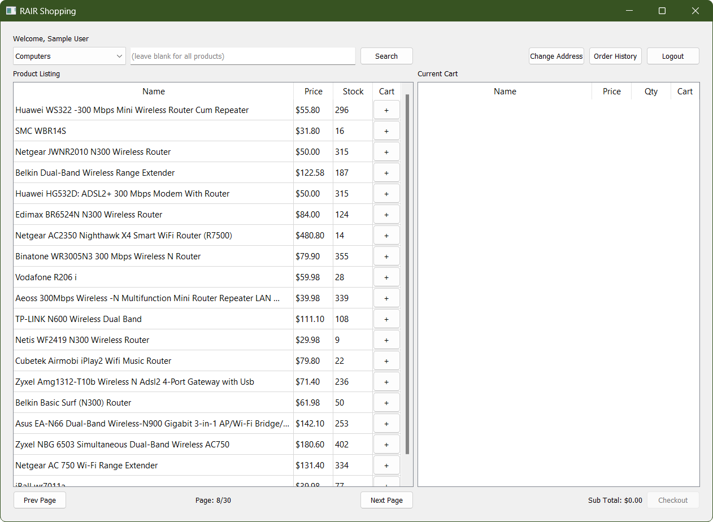

# RAIR Data Shopping Application
_Course project for DATA-225 (Database Systems for Analytics)_



**Team:** Ibrahim Khalid · Rutuja Kokate · Sung Won Lee · Ravjot Singh

---

## Overview

A full-stack desktop shopping application built with Python and PyQt5, backed by a
MySQL transactional database and a separate star-schema data warehouse. The project
demonstrates end-to-end database design — from schema creation and stored procedures
to ETL pipelines and analytical dashboards.

---

## Features

**Shopper**
- Browse and search products by name and category with pagination
- Add/remove items from a live shopping cart with real-time stock tracking
- Apply promo codes at checkout with automatic discount calculation
- Place orders and view full order history with itemized details
- Update shipping address from within the app

**Admin**
- Manage products: edit pricing/stock, add new listings
- Manage customers: search by email, edit profile and admin privileges
- Manage promo codes: create new codes and expire existing ones
- Trigger ETL to refresh the data warehouse
- Launch analytics dashboards as external processes

---

## Tech Stack

| Layer | Technology |
|---|---|
| GUI | Python, PyQt5 |
| Database | MySQL (stored procedures, transactions) |
| Data Warehouse | MySQL (star schema — fact & dimension tables) |
| ETL | MySQL stored procedure (`perform_etl`) |
| Data Processing | pandas |

---

## Architecture

The application uses two separate MySQL databases:

- **`rairdata_db`** — transactional database (users, products, orders, promo codes)
- **`rairdata_wh`** — analytical data warehouse with a star schema:
  - Fact tables: `fct_order_and_order_items`, `fct_promotions`
  - Dimension tables: `dim_datetime`, `dim_products`, `dim_customer_demographics`, `dim_customer_locations`

All database interactions go through stored procedures. Application logic is cleanly
separated into GUI classes, a utility/data-access layer (`UtilsClass`), and data
models (`UserData`, `CartData`).

---

## Running the Project

1. Copy `config.ini.tmp` → `config.ini` and fill in your credentials
2. Ensure databases `rairdata_db` and `rairdata_wh` exist
3. Run the setup script (creates schema, seeds data, runs ETL):
   ```bash
   python data.py
   ```
4. Launch the application:
   ```bash
   python main.py [--local] [--auto-login | --auto-login-admin]
   ```

**Demo credentials**

| Role | Email | Password |
|---|---|---|
| User | user@rair.com | 12345678 |
| Admin | admin@rair.com | 12345678 |

---

## Data Sources

- User and promo code data generated via [Mockaroo](https://mockaroo.com)
- Product data from the [Flipkart Products dataset](https://www.kaggle.com/datasets/PromptCloudHQ/flipkart-products) on Kaggle
